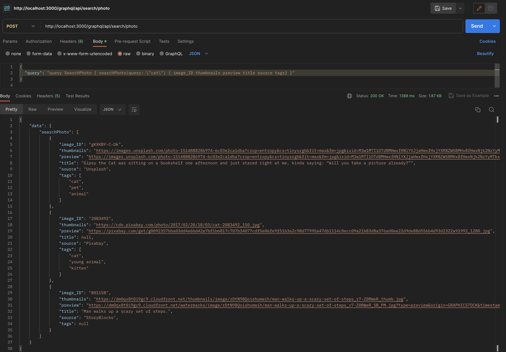
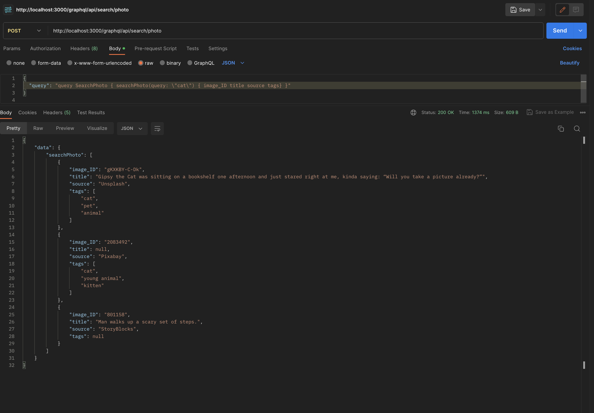
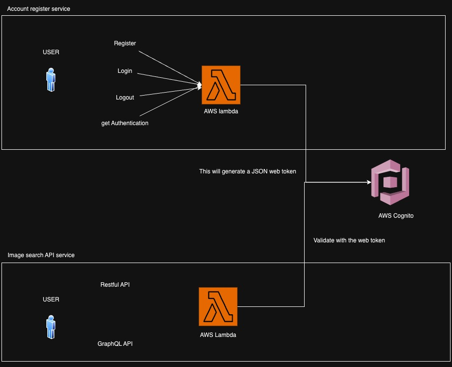

# pantheonLabCodeTest

# Question 2 

> Version of Main/Master branch is the most update version that include the optional challenge task , please switch to `q2-original` branch if you are looking for the restful API versions 

Requirement:
- [x] nodeJs (I used pure NodeJS, without expressJS)
- [x] simultaneous API call
- [x] Error Handling , return result from successful source API call even some call from other source fail

Optional:
- [x] Use GraphQL instead of restful API 
(For bellow tasks, as time is limited, I did some drawings and expanation )

- [ ] Authentication (AWS cognito, as I want to have a try of AWS cognito authentication service, I will finish the GraphQL task first then do Authentication with AWS)
- [ ] host on AWS 
- [ ] 1000 req/s 

For your convenience, I have keep both API in the server

RESTFUL API : (GET) localhost:3000/api/search/photo?query=cat

GraphQL API : (POST) localhost:3000/graphql/api/search/photo

Please include the following JSON in HTTP body
```JSON
{
  "query": "query SearchPhoto { searchPhoto(query: \"cat\") { image_ID thumbnails preview title source tags} }"
}
```


## run the code / installation 
To run the program please create a `.env` file with the following format, Please replace `ABC1234567890DEF` to your own credential

```
UNSPLASH_API_KEY = 'Client-ID ABC1234567890DEF'
PIXABAY_API_KEY = 'ABC1234567890DEF'
STORYBLOCKS_PUBLIC_KEY = 'ABC1234567890DEF'
STORYBLOCKS_PRIVATE_KEY = 'ABC1234567890DEF'
```
Run following command in `{repository-path}/question2`
```
npm install
node app.js
```

## Features


### `Promise.all` for Concurrent Requests:

`Promise.all()` is a built-in JavaScript method that takes an array of promises as input and returns a new promise. This new promise resolves when all the promises in the input array have resolved or when any one of them rejects.


In this code, three fetch functions (`fetchUnsplashData`, `fetchPixabayData`, and `fetchStoryBlocksData`) are called concurrently using `Promise.all()`. These functions likely make HTTP requests to their respective services to fetch data.


Each fetch function is wrapped in a `.catch()` block to handle errors gracefully. If any of these functions fail (throw an error), they return null to prevent the entire `Promise.all()` from failing prematurely.

### Error Handling

Inside the `.catch()` blocks for each fetch function, error messages are logged to the console. This ensures that if any of the services encounter an error, you will be aware of it.

In the event of an error within any of the fetch functions, they return null for the promises. This guarantees that the services will provide data from successful calls, even if some of them fail.

### Filter out `null` result

After all three promises are settled (resolved or rejected), the `.then()` block is executed. It receives an array of results (which can include both data and null values).

The results array is filtered using `filter()` to remove any null values. This step ensures that only successful responses from the services are included in the final filteredResults array.

## Result
This is the result of calling the api in postman 


## Comparison to the expected result

Given sample outcome:


### split tags
The tags provided in Pixabay Api is a string of tags , I split it into multiple tags with an array to be more consistent 

### null tags in storyblocks

I believe there is some changes of the api, current version does not have tags included 


[StoryBlock API reference](https://documentation.storyblocks.com/#ae3e53a1-a9f5-45ef-afc7-9a0f9b33f228)

## Graph QL 
Nothing really special, just implement the library (First time GraphQL user)
### Ask for what you need, get exactly that

With all parameters


Without preview and thumbnail URL


## AWS + Authentication
> I did try to implement the following architecture, However there are some bugs and issue on going. it takes some more time but the time remaining are not enough for me to finish this task, My AWS related code will be place under `{repository-path}/question2_aws` (There are not any working code for the following)



I proposed to use AWS Cognito to authenticate users

### Difficulty encounter
Account need to get verified and confirm by admin 
this require to write a lambda function for auto - confirm and auto - verification if I want to skip the verification and confirmation process (which I am runnign out of time)

### AWS Lambda vs EC2
There are 2 common solution for deploying the server, Both are reasonable 
Here are the reason of using AWS lambda or EC2

### EC2: 

#### Full Control and Flexibility: 

AWS EC2 provides you with full control over the virtual machines (EC2 instances) that you deploy. You can choose the operating system, configure the instance to your exact specifications, and install any software you need. This level of control is well-suited for applications that require custom configurations or have complex dependencies.

#### Scalability
With AWS EC2, you can manually scale your application by launching additional instances to handle increased traffic or workload. EC2 Auto Scaling allows you to automate this process based on predefined scaling policies, ensuring that your application can handle varying levels of demand efficiently.

### AWS Lambda:

#### Serverless Architecture: 
AWS Lambda allows you to build serverless applications, where you don't need to manage servers or infrastructure. Lambda automatically scales to handle incoming requests, and you're billed only for the compute time your code actually consumes. This simplifies the deployment and operational aspects of your application.

#### Low Maintenance Overhead
Lambda automatically takes care of server provisioning, maintenance, and scaling, allowing you to focus on writing code and developing features rather than managing infrastructure. This reduces the operational burden and allows your team to be more productive.

## 1000 req /s 

### Bottlenecks : 

#### the rate limit of external API

My solution : add a reddis cache service to the server, if the query string exist in the cache server, and it is just within 10mins of duration, then return the value in cache server. return the value in cache server will not refresh the expiry time of cache in the server

##### reason of not refresh the expiry time

As we do not want the value never update, e.g. beach will be hot keyword in summer, if every 9 minutes there are someone searching beach, the server will return the same result in the whole summer.

#### another bottleneck will be can a lambda service afford the load of 1000req/s

> From my research a lambda service could automatically scale, so a load balancer might not be actually needed, but time is limited, so I do not have the time to really test it out.

If the lambda service cannot be automatically scale, and we do not want it to be vertically scale/ we had already reach the limit of vertically scale (in normal case for a simple service like this should be able to afford 1000 req/s ) but let's say if it cant.


I propose to add a load balancer to distribute the workload to different service, which we could simply use the round robin strategy

From chat gpt:
>Here's how the round-robin load balancing strategy works:

>Initialization: The load balancer maintains a list of backend servers, often referred to as a server pool or server farm.

>Request Distribution: When a new request arrives at the load balancer, it assigns the request to the next server in the list. The load balancer keeps track of the current server in use.

>Circular Rotation: With each new request, the load balancer moves to the next server in the list, cycling through the available servers in a circular fashion.

>Even Distribution: Over time, as requests are distributed to the servers in a cyclical manner, the round-robin strategy aims to evenly balance the traffic load among all the servers in the pool.

>Benefits of Round-Robin Load Balancing:

>Simplicity: Round-robin is easy to implement and requires minimal configuration. It is a good choice for basic load balancing scenarios.

>Equal Distribution: It ensures that each server in the pool receives an equal share of requests, promoting fairness in resource utilization.

# Question 1

- [x] play, pause button
- [x] some text effect
- [ ] React hook

https://codesandbox.io/s/great-river-cp5wry?file=/src/index.js 