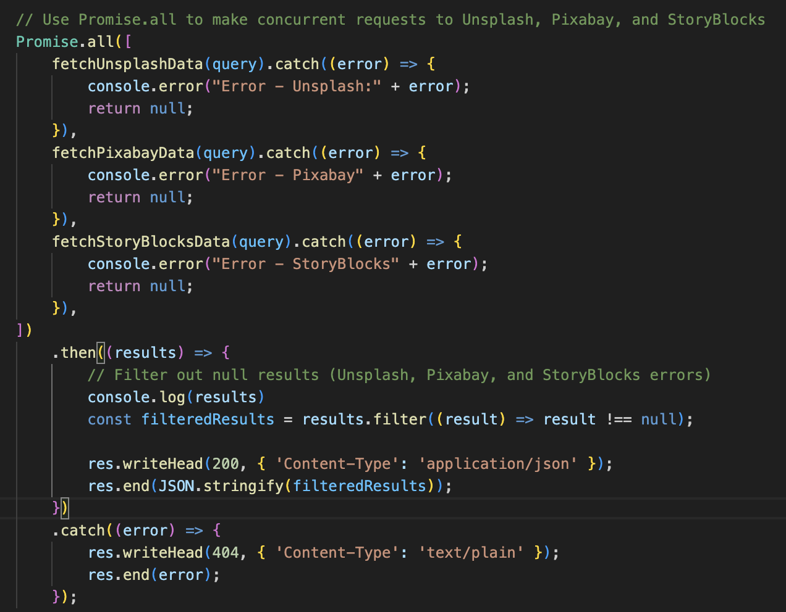
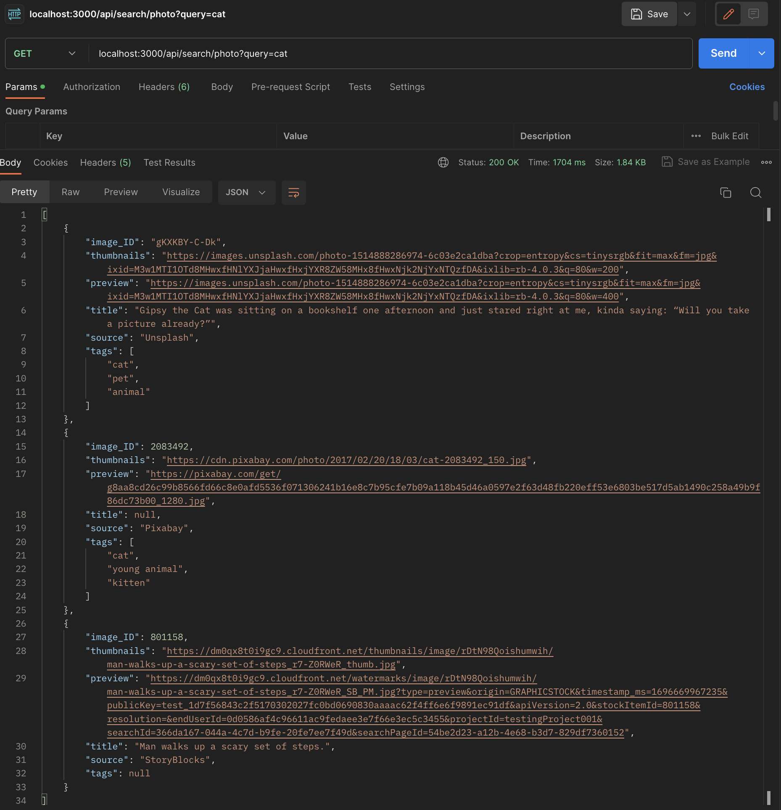
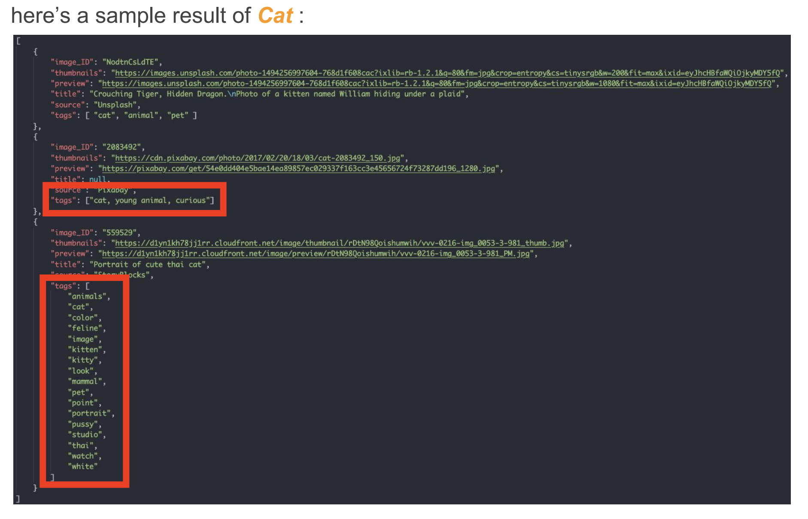
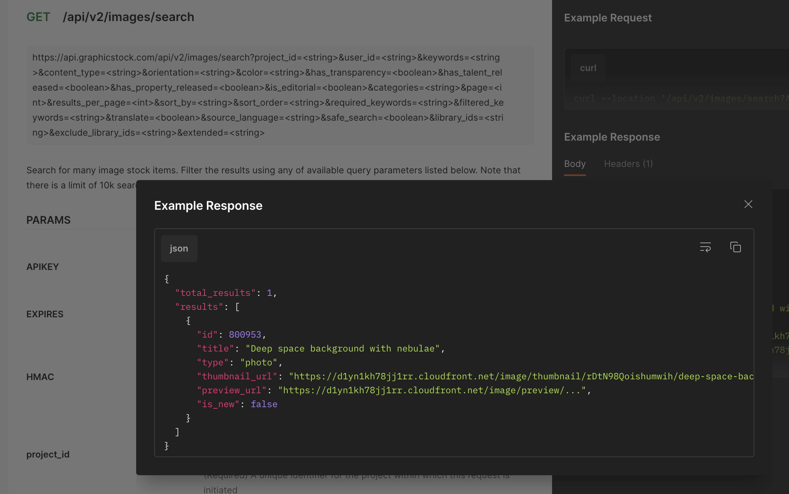

# pantheonLabCodeTest

# Question 2 

> Version of Main/Master branch is the most update version that include the optional challenge task , please switch to `q2-original` branch if you are looking for the restful API versions 

Requirement:
- [x] nodeJs (I used pure NodeJS, without expressJS)
- [x] simultaneous API call
- [x] Error Handling , return result from successful source API call even some call from other source fail

Optional:
- [ ] Use GraphQL instead of restful 
- [ ] Authentication (AWS cognito, as I want to have a try of AWS cognito authentication service, I will finish the GraphQL task first then do Authentication with AWS)
- [ ] host on AWS 
- [ ] 1000 req/s 

## run the code / installation 
To run the program please create a `.env` file with the following format, Please replace `ABC1234567890DEF` to your own credential

```
UNSPLASH_API_KEY = 'Client-ID ABC1234567890DEF'
PIXABAY_API_KEY = 'ABC1234567890DEF'
STORYBLOCKS_PUBLIC_KEY = 'ABC1234567890DEF'
STORYBLOCKS_PRIVATE_KEY = 'ABC1234567890DEF'
```
Run following command in `{repository-path}/question2`
```
npm install
node app.js
```

## Features



### `Promise.all` for Concurrent Requests:

`Promise.all()` is a built-in JavaScript method that takes an array of promises as input and returns a new promise. This new promise resolves when all the promises in the input array have resolved or when any one of them rejects.


In this code, three fetch functions (`fetchUnsplashData`, `fetchPixabayData`, and `fetchStoryBlocksData`) are called concurrently using `Promise.all()`. These functions likely make HTTP requests to their respective services to fetch data.


Each fetch function is wrapped in a `.catch()` block to handle errors gracefully. If any of these functions fail (throw an error), they return null to prevent the entire `Promise.all()` from failing prematurely.

### Error Handling

Inside the `.catch()` blocks for each fetch function, error messages are logged to the console. This ensures that if any of the services encounter an error, you will be aware of it.

In the event of an error within any of the fetch functions, they return null for the promises. This guarantees that the services will provide data from successful calls, even if some of them fail.

### Filter out `null` result

After all three promises are settled (resolved or rejected), the `.then()` block is executed. It receives an array of results (which can include both data and null values).

The results array is filtered using `filter()` to remove any null values. This step ensures that only successful responses from the services are included in the final filteredResults array.

## Result
This is the result of calling the api in postman 


## Comparison to the expected result

Given sample outcome:


### split tags
The tags provided in Pixabay Api is a string of tags , I split it into multiple tags with an array to be more consistent 

### null tags in storyblocks

I believe there is some changes of the api, current version does not have tags included 



[StoryBlock API reference](https://documentation.storyblocks.com/#ae3e53a1-a9f5-45ef-afc7-9a0f9b33f228)

